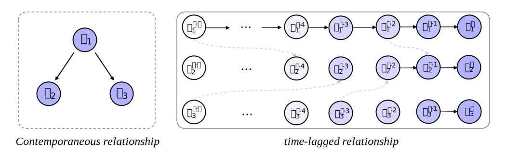

<h2 align="center">LARE: Learning to Infer Causal Structure from Time Series Data with Latent Representations</h2>

  <a href="https://faculty.bjtu.edu.cn/rjxy/7930.html"><strong>Weiwei xing</strong></a>
  .
  <a href="https://cyue0316.github.io/"><strong>Yue Cheng</strong></a>
  ·  
  <a href="https://scholar.google.com.hk/citations?hl=zh-CN&user=nBlNxhEAAAAJ"><strong>Xiaohui Gao</strong></a>
  ·
  <a href="https://scholar.google.com.hk/citations?user=0nrcfZwAAAAJ&hl"><strong>Witold Pedrycz</strong></a>
   
  

 

## 💬 LARE Pipeline 🗨️

- [ ] Source code will be released shortly. (Please check our [project page](https://github.com/Cyue0316/LARE/) :)
 

## ✍️ Paper summary
An important goal of multivariate time series analysis is to explain the underlying structure between the individual series to provide an interpretable output within understanding various phenomena. However, the high dimension properties of time series introduce complex dynamic interaction information between individual series and present significant causal structure discovery challenges. Among the many choices for causal insights about an underlying process, Directed Acyclic Graphs (DAGs) have shown promise, clearly describing the degree of influence between variables by investigating the edges of the graph.

LARE can effectively alleviate some of the limitations of numerical difficulties in causal discovery methods for stationary time series data in high-dimensionality, nonlinear interaction pattern recognition, and causal matrix optimization. Primarily, we present a learnable Node Correlation Matrix (NCM) to capture node embeddings participating in causal structures. Based on NCM, we subsequently propose to maintain a learnable Structure Identification Matrix (SIM) as the latent representation space of the causal graphs that is able to identify the target node embeddings automatically. More importantly, we can apply nonlinear structures such as multilayer perceptrons (MLPs) or convolutional neural networks (CNNs) to estimate SIM, thereby modeling nonlinear causal relationships efficiently.

